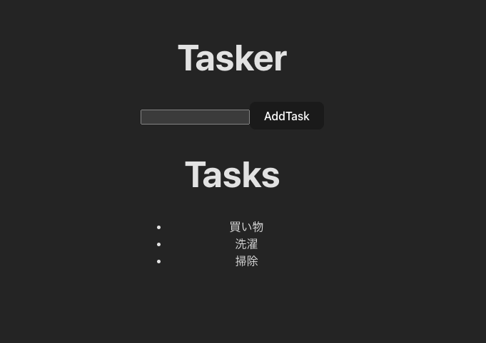
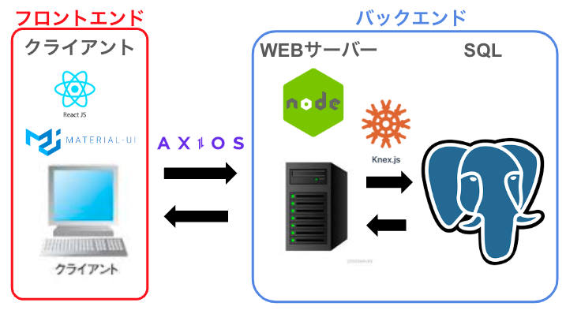

# Task Manager App 　ガイド

ようこそ、Task Manager App 　リポジトリ へ！
このアプリはタスクを管理できます。使用時は下記をご一読ください。

<!-- 明確なセットアップ手順、アプリの詳細、リソース、および将来の計画が記載さ -->

## 目次

1. [セットアップ手順](#セットアップ手順)
1. [アプリの詳細](#アプリの詳細)
1. [リソース](#リソース)
1. [将来計画](#将来計画)

## セットアップ手順

### server

1. server ディレクトリへ移動

```js
cd server
```

1. node モジュールのインストール

```js
npm i
```

1. データベースの作成

```psql
echo "CREATE DATABASE task_mane;" | psql
```

1. '.env'ファイルの作成
   ファイル直下に.env ファイルを作成し、下記内容項目を追加してください。
   尚、'DB_USER'と'DB_PASSWORD'の値はご自身の任意の値を追加してください。

- DB_USER=user
- DB_PASSWORD=null
- DB_NAME=task_mane
- NODE_ENV=development

1. テープルの作成

```js
npm run migrate
```

1. テープルの初期データの挿入(任意)

```js
npm run seed
```

1. サーバーを立ち上げる

```js
npm run start
```

### client

1. client ディレクトリへ移動

```js
cd client
```

1. node モジュールのインストール

```js
npm i
```

1. react の立ち上げ

```js
npm run dev
```

## アプリの詳細

### メインページ

- テキストボックスにタスクを記入し、AddTask ボタンを押下することで、タスクを追加できます
  

## リソース


※提供：おがちゃん 🥷

## 将来計画

- タスクの削除機能
- タスクの編集機能
- タスクの検索機能の追加
- ログイン機能を追加し、あなただけのメモアプリを提供
